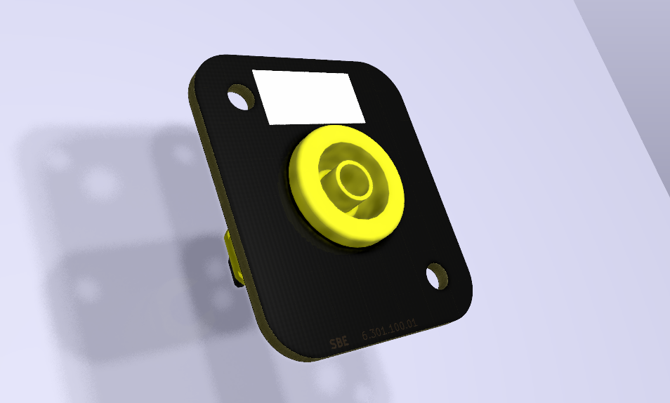
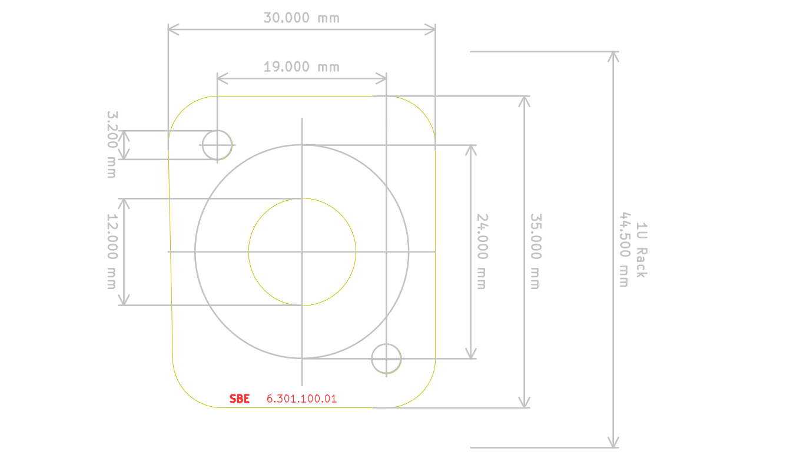

# D-Type to Banana Jack mounting panel

PCB adapter board to mount one 4mm safety banana socket to a D-Type mounting hole (19 inch racks)

`SBE 6.301.100.01`

---

- Adam Hall [872213_AH_19PARTS](https://adamhall.s3.amazonaws.com/media/MARKEN/AH19PARTS/872213/872213_AH_19PARTS_Technische_Zeichnung_EN_DE_FR_ES.PDF
)
- [CT2242_drawing.pdf](http://www.caltestelectronics.com/images/attachments/CT2242_drawing.pdf)

